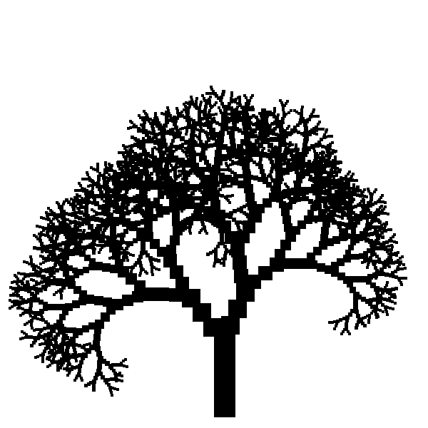

# Light: 15-112 Term Project

A platform-based game built for CMU 15-112 (Fundamentals of Programming and Computer Science).

## Video Demo

**Watch the demo:** https://youtu.be/z6uWbX5XHyY

## About the Game

Light is a platformer with three freely accessible levels: an underwater cave system on the bottom, caves in the middle, and trees on top. The player traverses the map collecting fireflies. Every once in a while, the screen flashes and an event occurs, and the player must seek shelter in the light spot before the flashing ends. The game ends when the player finds all the fireflies, or dies to the spiders during an event.

## Notable Features

### Fractal Trees

The forest level's background trees are generated procedurally with a recursive fractal algorithm (`drawTreeFractal` in `src/PILbackgroungPictures.py`). Starting from a single trunk, each branch spawns two child branches rotated 30 degrees to either side, with the length and width shrinking by a constant factor each generation until the branches get too small to draw. A gaussian random offset is added to each branch angle so every tree grows a little differently, and the finished branches are rendered as chunky pixel squares (`pixelManyLineClass`) to match the game's pixel-art style. The same set of branch lines is drawn twice: black on white for the normal background, and recolored white on black for the flash events.

<p align="center">
  
</p>

This tree was generated directly from the game's own tree code.

## Run Instructions

Run `src/RUNFILE.py` in an editor. The project is made entirely with `cmu_graphics` and the `Pillow` module, so both should be installed. There are no extra data or source files to download.

```
pip install cmu-graphics pillow
```

## Controls

| Key | Action |
| --- | --- |
| Arrow keys | Movement |
| `c` | Cut spiderwebs |
| `p` | Pause |

### Shortcut Commands

| Key | Action |
| --- | --- |
| `t` | Teleport down to skip a level |
| `e` | Teleport halfway down a level |
| `w` | Automatically win the game |

## Project Files

- `src/`: game source code (entry point: `RUNFILE.py`)
- `TP3 Project Proposal.pdf`: project proposal
